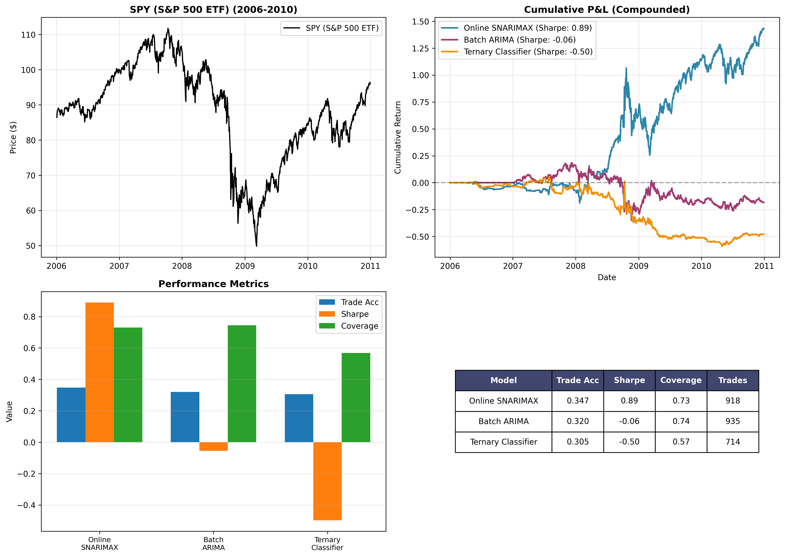

# Online Learning for Financial Time Series
**TUM Seminar — Online and Continual Machine Learning (WS 2025/26)**
Erik Eremenko & Sam Muller

## Overview
Survey and empirical evaluation of online learning algorithms applied to
S&P 500 time series. Compares SNARIMAX, ARIMA, and classification-based
approaches across three market regimes (2008 crisis, 2015–18, COVID-19).

## Key Results
| Model | Sharpe (2008) | Sharpe (2015-18) |
|-------|--------------|-----------------|
| Online SNARIMAX | **0.89** | 0.49 |
| Batch ARIMA | -0.06 | 0.39 |
| Ternary Classifier | -0.50 | 0.04

## Results



*Online SNARIMAX achieves Sharpe 0.89 during the 2008 crisis,
significantly outperforming Batch ARIMA (-0.06) and the Ternary Classifier (-0.50).*

## Paper
[OL_CAML_TUM_Eremenko_Muller.pdf](./OL_CAML_TUM_Eremenko_Muller.pdf)

## How to run the code:
1. Create a virtual environment with python3.11:
   ```bash
   python3.11 -m venv venv
   source venv/bin/activate
   ```

2. Install the required packages:
   ```bash
   pip install -r requirements.txt
   ```

3. See all options:
   ```bash
   python3 financial_models.py --help
   ```

## Examples

### Run 2008 crisis scenario (daily predictions)
   ```bash
python3 financial_models.py --scenario crisis --approach next_step
```

### Run all scenarios with 20-day trade horizon
   ```bash
python3 financial_models.py --scenario all --approach multi_day --frequency 20
```

   
## Note on reproducibility
Data is downloaded from Yahoo Finance at runtime via `yfinance`.
Results may vary slightly depending on download date due to data revisions.
To cache: run once and save with `data.to_csv("spy_cache.csv")`.